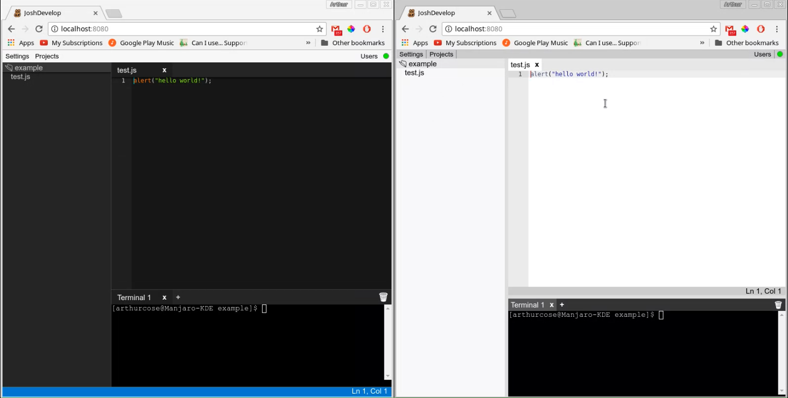

# JoshDevelop

JoshDevelop is a web based realtime collaborative editor designed for quick setup. Just run `npm install`, and launch a run.* script.

You can access the editor through a web browser using the address of the host machine
(http://localhost:8080 to access from the host machine by default)

## Video:

