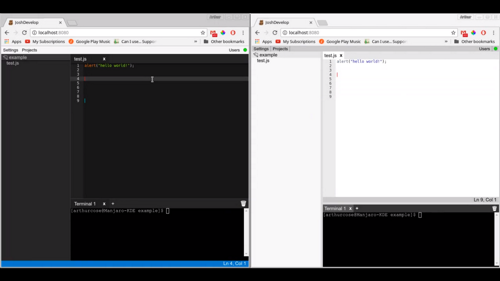

# JoshDevelop

JoshDevelop is a web-based collaborative editor.

Run `npm install`, and launch a run.* script. You can then access the editor through a web browser using the address of the host machine.
(http://localhost:8080 to access from the host machine by default)

## Video:

https://youtu.be/cCpkSRIdujA